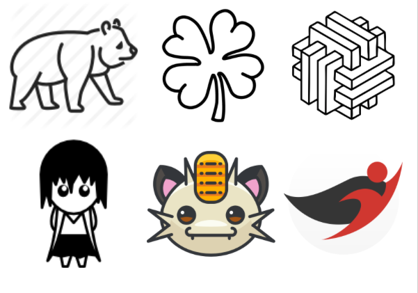

# Conditional Style-Based Logo Generation with Generative Adversarial Networks

Implementation of a conditional StyleGAN architecture based on the official source code [published by NVIDIA](https://github.com/NVlabs/stylegan)


**Figure 1:** *A preview of logos generated by the conditional StyleGAN synthesis network.*


> **Conditional Style-Based Logo
Generation with Generative Adversarial
Networks**<br>

> **Abstract:** *Domains such as logo synthesis, in which the data has a high degree of multi-modality, still pose a challenge for generative adversarial networks (GANs). Recent research shows that progressive training (ProGAN) and mapping network extensions (StyleGAN) enable both increased training stability for higher dimensional problems and better feature separation within the embedded latent space. However, these architectures leave limited control over shaping the output of the network, which is an undesirable trait in the case of logo synthesis. This thesis explores a conditional extension to the StyleGAN architecture with the aim of firstly, improving on the low resolution results of previous research and, secondly, increasing the controllability of the output through the use of synthetic class-conditions. Furthermore, methods of extracting such class conditions are explored with a focus on the human interpretability, where the challenge lies in the fact that, by nature, visual logo characteristics are hard to define. The introduced conditional style-based generator architecture is trained on the extracted class-conditions in two experiments and studied relative to the performance of an unconditional model. Results show that, whilst the unconditional model more closely matches the training distribution, high quality conditions enabled the embedding of finer details onto the latent space, leading to more diverse output.*

#### Model Training Progress YouTube video:
[](https://www.youtube.com/watch?v=GjcuMByKgKs)
## BoostedLLD
For this paper we removed all text-based images from the [LLD-logo dataset](https://data.vision.ee.ethz.ch/sagea/lld/#paper) and extended the remaining logos with image based logos and illustrations scraped off of Google images.


**Figure 2:** *As seen above, the extension also included vector illustrations that were not originally intended as logos, but carry visual characteristics of such.*


###### The data will be made available shortly.

## Data Preparation
The ```dataset_tool.py``` script is responsible for turning your data into Tensorflow record files. However, each image in the data set must have the <u>exact</u> same format in terms of size, extension, colour space and bit depth. Any irregular images will automatically be kicked from the data set.

We refer you to the [imagemagick](https://imagemagick.org/index.php) library for all transformation tools.

The scipt takes a pickled dictionary as input with the following format:

```
# Pickle path = '../data/mypickle.pickle'
mypickle = {"Filenames": list_of_file_paths, "Labels": class_condition_labels}
```

The script is run from the terminal and takes the paths to your images and the path of your TF-record directory as flags

```
python dataset_tool.py create_from_images dataset/logos ../data/my_images
```

## Training

These variables have to be adjusted according to your needs in multiple scripts before training:

#### Path to TF records (e.g. dataset/logos)
- ```train.py``` line 37:

> ``` desc += '-logos';     dataset = EasyDict(tfrecord_dir='logos', resolution=128);```

- ```./training/dataset.py``` line 49:

> ```self.tfrecord_dir       = 'dataset/logos'```

#### Number of class-conditions
<i>These lines refer to section at which you can also adjust hyperparameters.</i>
- ```./training/networks_stylegan.py``` line 388 & line 569:

> ``` label_size = 10```
